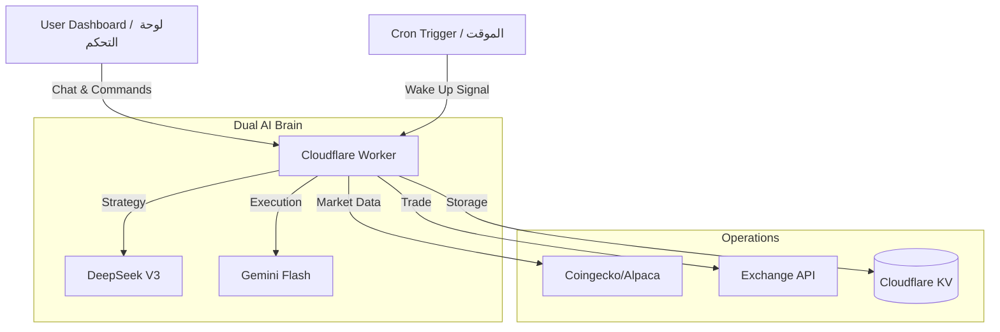

# 🌌 ANTIGRAVITY TERMINAL (v1.0)

### The First AI-Native, Serverless Trading Ecosystem

### أول نظام تداول سحابي مدعوم بالذكاء الاصطناعي "ثنائي النواة"


---

## 🌍 Overview | نبذة عامة

**English:**
Antigravity Terminal is an institutional-grade trading platform designed to democratize Hedge Fund technology. By leveraging a **Dual-Core AI Architecture** (DeepSeek + Gemini) and running on **Cloudflare Edge**, it removes emotional bias from trading, executing mathematical strategies with surgical precision at **zero infrastructure cost**.

**العربية:**
نظام "أنتي غرافيتي" هو منصة تداول بمواصفات مؤسسية صُممت لنقل تكنولوجيا "صناديق التحوط" إلى المتداول الفردي. يعتمد النظام على **معمارية ذكاء اصطناعي ثنائية النواة** (تدمج بين DeepSeek و Gemini) ويعمل بالكامل على **خوادم الحافة (Cloudflare Edge)**، مما يزيل العامل العاطفي من التداول وينفذ استراتيجيات رياضية دقيقة **بتكلفة تشغيل صفرية**.

---

## 💎 Pricing Plans | باقات الاشتراك

Choose the power level that fits your trading goals.
اختر الباقة التي تناسب أهدافك الاستثمارية.

| Feature | **Starter (Community)** | **Pro (Trader)** | **Institutional (Whale)** |
| :--- | :---: | :---: | :---: |
| **Cost** | **Free / Open Source** | **$49 / Month** | **Custom Pricing** |
| **AI Brain** | Gemini Flash Only | **Dual-Core (DeepSeek + Gemini)** | Custom LLM Models |
| **Trading Pairs** | Crypto Only | Crypto + Stocks + Gold | All Assets + Futures |
| **Updates** | Every 5 Minutes | **Real-Time (1 min)** | **Tick-by-Tick** |
| **Support** | Community Docs | Email Support | 24/7 Dedicated Agent |
| **Deployment** | Self-Hosted | Managed Cloud | On-Premise Setup |

> **Note:** This repository represents the **Starter/Pro** hybrid architecture.
> **ملاحظة:** هذا المستودع يمثل البنية التقنية الهجينة بين باقتي الستارتر والبرو.

---

## 🚀 Key Capabilities | الميزات الأساسية

### 🧠 1. The Dual-Core Brain (العقل ثنائي النواة)

The system splits cognition into two specialized cores:
يقوم النظام بتقسيم الذكاء إلى نواتين متخصصتين:

* **The Strategist (DeepSeek-V3):** Runs on the backend. Analyzes complex macro patterns and volume anomalies to set the daily bias.
  * *المخطط الاستراتيجي:* يعمل في الخلفية لتحليل الأنماط المعقدة وتحديد الاتجاه العام للسوق.
* **The Operator (Gemini 1.5):** Runs in real-time. Handles execution, risk management, and chat interaction.
  * *المنفذ التكتيكي:* يعمل لحظياً لإدارة الصفقات، المخاطر، والدردشة مع المستخدم.

### 🌐 2. Multi-Language Support (دعم ثنائي اللغة)

* **Native Arabic (RTL):** Fully optimized UI for Arabic users with Right-to-Left layout.
  * *واجهة عربية كاملة:* تصميم يدعم الاتجاه من اليمين لليسار لتجربة مستخدم طبيعية.
* **Global English:** Standard institutional interface.

### 🛡️ 3. Risk Engine (محرك المخاطر)

* **Hard Stop:** Automated Stop-Loss on every trade.
* **Antigravity Gauge:** Visual momentum indicator.
* **Panic Protocol:** One-click liquidation.

---

## 🏗️ Technical Architecture | البنية التقنية



## 🛠️ Quick Start | دليل التشغيل

### Prerequisites

* Node.js & npm
* Python 3.10+
* Cloudflare Account (Free Tier)

### 1. Installation (التثبيت)

```bash
# Clone the repo
git clone https://github.com/Moeabdelaziz007/Trading-Bot-System-v0.01.git

# Install Dependencies
cd frontend && npm install
cd ../backend && pip install -r requirements.txt
```

### 2. Configuration (الإعدادات)

Create `.env` file and add your keys:
قم بإنشاء ملف `.env` وأضف مفاتيحك:

```ini
NEXT_PUBLIC_LANG="en" # or "ar"
DEEPSEEK_API_KEY="sk-..."
GEMINI_API_KEY="AIza..."
ALPACA_API_KEY="PK..."
```

### 3. Launch (الإطلاق)

```bash
# Run with Docker (Recommended)
docker-compose up --build
```

Access the dashboard at: <http://localhost:3000>

## 📂 Project Structure | هيكل المشروع

```plaintext
/
├── frontend/             # Next.js 14 (App Router)
│   ├── src/app/[lang]/   # Internationalization Routes (AR/EN)
│   ├── src/components/   # UI Widgets
│   └── public/locales/   # Translation Files (JSON)
├── backend/              # Python FastAPI
├── trading-cloud-brain/  # Cloudflare Worker (Edge Logic)
└── docker-compose.yml    # Orchestration
```

## ⚠️ Disclaimer | إخلاء مسؤولية

This software is for educational purposes only. The "Antigravity" algorithm does not guarantee profits.
هذا البرنامج للأغراض التعليمية فقط. خوارزمية "الجاذبية العكسية" لا تضمن الأرباح. استخدم التداول الورقي (Paper Trading) أولاً.

---
Built with 💻 & ☕ by [Moe Abdelaziz]
