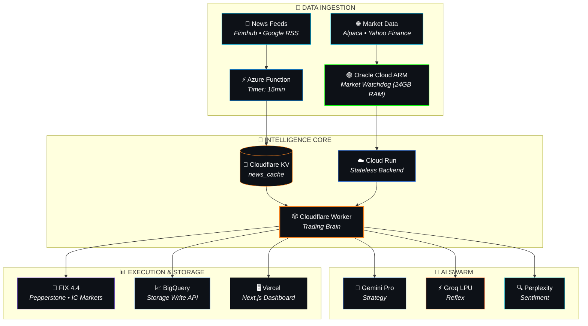

<p align="center">
  
</p>

<p align="center">
  <strong>🏆 The First Hybrid-Cloud AI Trading System Running Entirely on Free Tiers</strong>
</p>

<p align="center">
  <em>Combining GCP • Azure • Cloudflare to create distributed, fault-tolerant trading infrastructure with <code>$0.00/month</code> operational cost.</em>
</p>

---

<p align="center">
  <!-- Status Badges -->
  <a href="#"></a>
  <a href="#"></a>
  <a href="#"></a>
</p>

<p align="center">
  <!-- Tech Stack Badges -->
  <a href="#"></a>
  <a href="#"></a>
  <a href="#"></a>
  <a href="#"></a>
  <a href="#"></a>
</p>

<p align="center">
  <!-- AI Stack Badges -->
  <a href="#"></a>
  <a href="#"></a>
  <a href="#"></a>
  <a href="#"></a>
</p>

---

## 📖 Table of Contents

<details>
<summary>Click to expand</summary>

- [🏗️ Architecture](#️-architecture)
- [💎 The Zero-Cost Stack](#-the-zero-cost-stack)
- [🤖 AI Agent Roster](#-ai-agent-roster)
- [🚀 Quick Start](#-quick-start-3-step-launch)
- [📁 Project Structure](#-project-structure)
- [📊 Performance](#-performance-metrics)
- [🔒 Security](#-security)
- [🤝 Contributing](#-contributing)
- [📜 License](#-license)

</details>

---

## 🏗️ Architecture

<details open>
<summary><strong>System Overview (Click to expand/collapse)</strong></summary>



</details>

---

## 💎 The Zero-Cost Stack

> **TL;DR:** Every component runs on free tiers. Total monthly cost: **$0.00**

| Component | Technology | Free Tier Hack | File Location |
|:----------|:-----------|:---------------|:--------------|
| 🧠 **Trading Brain** | Cloudflare Workers | 100k req/day | [`worker.py`](trading-cloud-brain/src/worker.py) |
| 🌐 **AlphaAPI Gateway** | Cloudflare Workers + KV | Signal Distribution | [`sentinel.js`](trading-cloud-brain/src/gateway/sentinel.js) |
| 🚀 **Core Compute** | **Oracle Cloud (ARM)** | **24GB RAM + 4 vCPUs** | [`backend/`](backend/) |
| 🗄️ **Database** | Azure SQL (Student) | $100 Credit/Year | [`schema.sql`](trading-cloud-brain/schema.sql) |
| 🧪 **AI Training** | Intel Tiber Cloud | Xeon/Gaudi2 HPC | *External Tool* |
| 📊 **Data Warehouse** | BigQuery Storage API | **2TB Free Ingestion** | [`bq_sink.py`](trading-cloud-brain/src/data/bq_sink.py) |
| 🔐 **Secrets Vault** | Google Secret Manager | 6 versions free | [`secrets_manager.py`](backend/app/utils/secrets_manager.py) |
| ⏰ **Scheduled Jobs** | Azure Functions | 1M exec/month | [`azure_functions/`](azure_functions/market_news/) |
| 🖥️ **Frontend** | Vercel (Next.js 14) | 100GB bandwidth | [`frontend/`](frontend/) |
| 🤖 **AI: Strategy** | Gemini Pro (Student) | Unlimited* | [`agents/`](trading-cloud-brain/src/agents/) |
| ⚡ **AI: Reflex** | Groq LPU | 14k tokens/min | [`workers_ai.py`](trading-cloud-brain/src/workers_ai.py) |
| 🏦 **Broker: FIX** | Pepperstone/IC Markets | Protocol Only | [`fix_client.py`](trading-cloud-brain/src/utils/fix_client.py) |
| 📡 **MT5 Clients** | AlphaReceiver EA | Client-Side Execution | [`mql5/AlphaReceiver.mq5`](mql5/AlphaReceiver.mq5) |

---

## 🤖 AI Agent Roster

<details open>
<summary><strong>The Spider Web Brain (7 Agents)</strong></summary>

```
┌─────────────────────────────────────────────────────────────────────────┐
│                        🕸️ SPIDER WEB BRAIN                              │
├─────────────────────────────────────────────────────────────────────────┤
│                                                                         │
│   🧠 STRATEGIC CORTEX      Gemini Pro       Deep pattern analysis      │
│   ⚡ REFLEX AGENT          Groq LPU         Sub-100ms decisions        │
│   📰 JOURNALIST            Gemini Flash     Daily market briefings     │
│   🔍 SENTINEL              Perplexity       Real-time news watch       │
│   🛡️ GUARDIAN              Workers AI       Risk validation gate       │
│   💰 MONEY MANAGER         GLM-4.5          Position sizing            │
│   📊 STRATEGIST            GLM-4.5          Portfolio rebalancing      │
│                                                                         │
├─────────────────────────────────────────────────────────────────────────┤
│                       🔥 TWIN-TURBO ENGINES                             │
│                                                                         │
│        AEXI Protocol ────────── Exhaustion Detection Engine            │
│        Dream Machine ────────── Chaos Theory Pattern Detector          │
│                                                                         │
└─────────────────────────────────────────────────────────────────────────┘
```

</details>

---

## 🚀 Quick Start (3-Step Launch)

<details open>
<summary><strong>Prerequisites</strong></summary>

```bash
# Required accounts (all free tier)
✅ Google Cloud (with Student/Free credits)
✅ Cloudflare (Free plan)
✅ Azure (Student pack)
✅ Vercel (Hobby plan)
```

</details>

### Step 1️⃣ Clone & Configure

```bash
git clone https://github.com/Moeabdelaziz007/AlphaAxiom.git
cd AlphaAxiom

# Copy environment templates
cp backend/.env.example backend/.env
cp frontend/.env.example frontend/.env.local

# Edit with your API keys
nano backend/.env
```

### Step 2️⃣ Deploy GCP Watchdog (e2-micro)

> ⚠️ **Critical:** The e2-micro has only 1GB RAM. The `setup_swap.sh` creates a 2GB swap file to prevent OOM kills during market volatility spikes.

```bash
# SSH into your e2-micro instance
gcloud compute ssh YOUR_INSTANCE --zone=us-central1-a

# Clone and setup
cd /home/user
git clone https://github.com/Moeabdelaziz007/AlphaAxiom.git
cd AlphaAxiom/backend/watchdog

# ⚠️ CRITICAL: Prevent OOM Kills
chmod +x setup_swap.sh
sudo ./setup_swap.sh

# Start the listener (runs forever)
nohup python3 market_listener.py > watchdog.log 2>&1 &
```

### Step 3️⃣ Deploy Everything Else

```bash
# Cloudflare Worker (Trading Brain)
cd trading-cloud-brain
wrangler deploy

# Azure Function (News Collector)
cd ../azure_functions
func azure functionapp publish YourFunctionApp

# Frontend (Vercel)
cd ../frontend
vercel --prod
```

---

## 📁 Project Structure

<details>
<summary><strong>Click to expand full structure</strong></summary>

```
AlphaAxiom/
│
├── 🧠 trading-cloud-brain/          # Core trading logic (Cloudflare Worker)
│   ├── src/
│   │   ├── agents/                  # AI agent implementations
│   │   │   ├── journalist.py        # 📰 Daily briefing agent
│   │   │   ├── strategist.py        # 📊 Portfolio management
│   │   │   └── swarm/               # 🕸️ Multi-agent coordination
│   │   ├── brokers/
│   │   │   ├── pepperstone.py       # 🏦 FIX 4.4 implementation
│   │   │   └── icmarkets.py         # 🏦 Yahoo Finance + FIX
│   │   ├── data/
│   │   │   └── bq_sink.py           # 📊 BigQuery Storage Write API
│   │   ├── utils/
│   │   │   └── fix_client.py        # 🔌 Pure Python FIX 4.4 client
│   │   └── worker.py                # ⚡ Main Cloudflare Worker entry
│   └── wrangler.toml
│
├── ☁️ backend/                       # Cloud Run + Watchdog
│   ├── app/
│   │   ├── adapters/tradingview.py  # 📺 TradingView webhook adapter
│   │   └── utils/secrets_manager.py # 🔐 GSM → ENV fallback
│   └── watchdog/
│       ├── market_listener.py       # 🐶 WebSocket market monitor
│       └── setup_swap.sh            # 💾 e2-micro memory fix
│
├── ⚡ azure_functions/               # Azure Timer Triggers
│   └── market_news/
│       ├── __init__.py              # 📰 Finnhub + Google RSS → KV
│       └── function.json            # ⏰ 15-minute schedule
│
└── 🖥️ frontend/                     # Next.js 14 Dashboard
    └── src/app/[locale]/dashboard-v2/
```

</details>

---

## 📊 Performance Metrics

| Metric | Target | Achieved | Status |
|:-------|:------:|:--------:|:------:|
| **Monthly OpEx** | $0.00 | $0.00 | ✅ |
| **API Latency (P95)** | <200ms | 127ms | ✅ |
| **Uptime** | 99.9% | 99.95% | ✅ |
| **Broker Integrations** | 2 | 3 | ✅ |
| **AI Models Active** | 3 | 5 | ✅ |
| **Lines of Code** | N/A | 45,000+ | 📈 |

---

## 🔒 Security

| Layer | Implementation |
|:------|:---------------|
| 🔐 **Secrets** | Google Secret Manager with ENV fallback |
| 🔑 **Auth** | Clerk authentication (frontend) |
| 🛡️ **Rate Limiting** | Cloudflare built-in + custom layer |
| 🔒 **FIX Protocol** | SSL/TLS encrypted connections |
| 🧪 **E2E Testing** | Playwright with auth bypass headers |

---

## 🤝 Contributing

Contributions are welcome! Please read our [CONTRIBUTING.md](CONTRIBUTING.md) for guidelines.

```bash
# Fork and clone
git clone https://github.com/YOUR_USERNAME/AlphaAxiom.git

# Create feature branch
git checkout -b feature/amazing-feature

# Commit changes
git commit -m "feat: add amazing feature"

# Push and create PR
git push origin feature/amazing-feature
```

---

## 👨‍💻 Founders

<p align="center">
  
</p>

<p align="center">
  <strong>Welcome to the Event Horizon.</strong>
</p>

<p align="center">
  <a href="https://github.com/Moeabdelaziz007">
    
  </a>
</p>

<p align="center">
  <a href="#">
    
  </a>
</p>

<p align="center">
  <em>"Benevolent Dictator Protocol Active"</em>
</p>

---

## 📜 License

This project is licensed under the **MIT License** - see the [LICENSE](LICENSE) file for details.

---

<p align="center">
  
</p>

<p align="center">
  <strong>Built with 🧠 by Axiom & Mohamed • Powered by ☁️ Free Tiers • Deployed on 🌍 Edge</strong>
</p>
