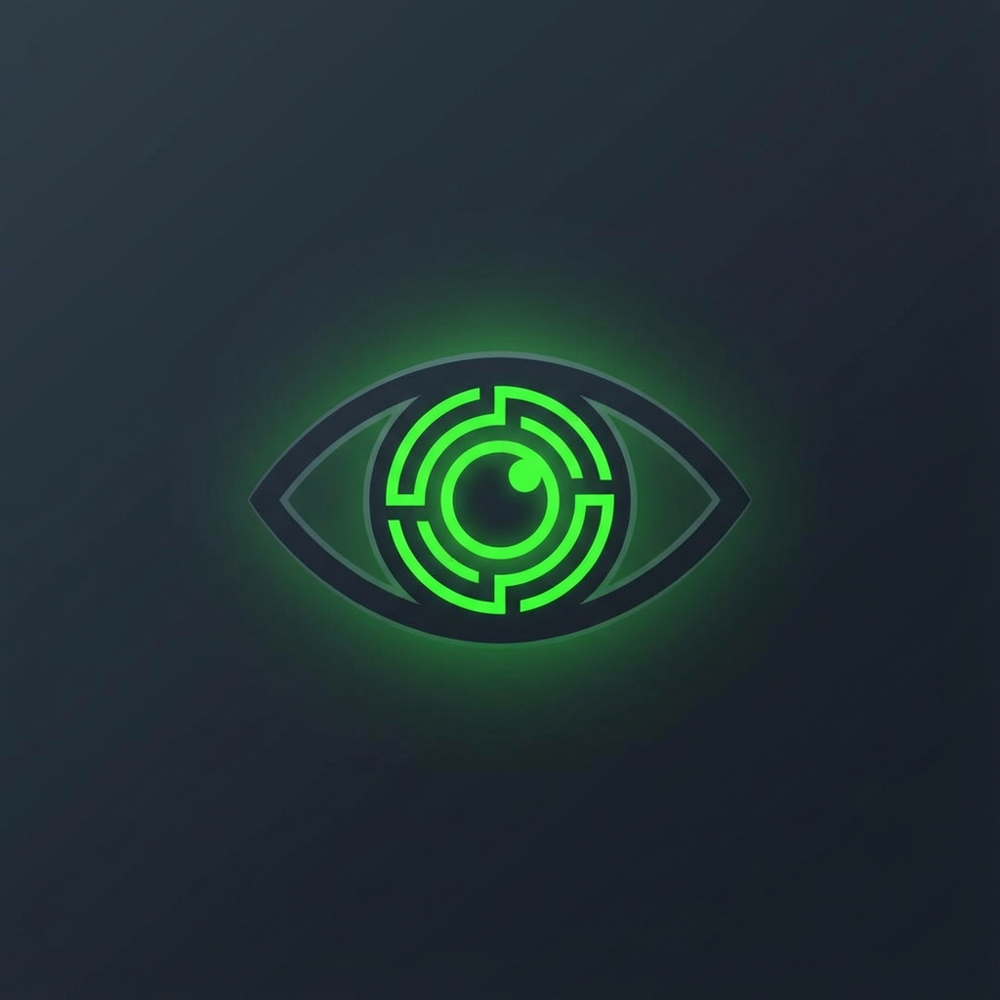
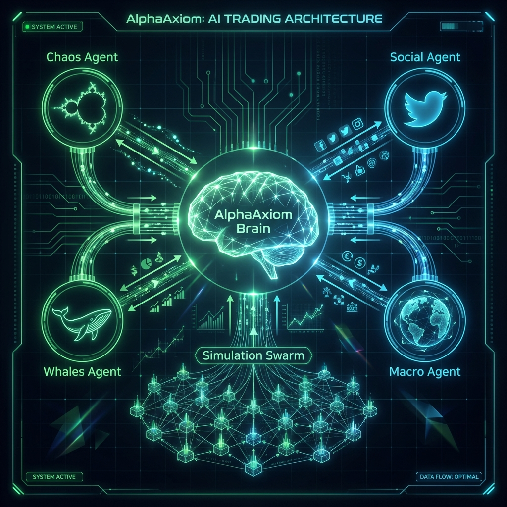

<div align="center">

# 🌌 AXIOM ANTIGRAVITY

### AI Trading Platform & Signal Hub | منصة تداول وإشارات بالذكاء الاصطناعي



**From Signals to Execution — Powered by GLM-4.5 + Gemini 2.0**

**من الإشارات إلى التنفيذ — مدعوم بـ GLM-4.5 + Gemini 2.0**

[](https://aitrading.axiomid.app)
[](LICENSE)
[](https://workers.cloudflare.com)
[](https://z.ai)
[](https://ai.google.dev)

---

*"We don't just signal. We execute."*

*"نحن لا نكتفي بالإشارات. نحن ننفذ."*

🚀 **v1.2 — Citadel Edition** | December 2025

</div>

---

## 📋 Table of Contents | جدول المحتويات

- [⚡ Features & Capabilities](#-features--capabilities)
- [🆕 What's New in v1.2](#-whats-new-in-v12)
- [🧠 AI Model Allocation](#-ai-model-allocation)
- [🏗️ Architecture (Spider Web)](#️-architecture-spider-web)
- [🎮 Dashboard & Agent Lab](#-dashboard--agent-lab)
- [🚀 Quick Start](#-quick-start)
- [💰 Zero-Cost Proof](#-zero-cost-proof)
- [🤝 Partnership](#-partnership)

---

## ⚡ Features & Capabilities | الميزات والقدرات

<table>
<tr>
<td width="50%">

### 🇺🇸 English

- 🧠 **Multi-AI Stack** — GLM-4.5 + Gemini 2.0 + Groq + Workers AI
- 🕷️ **Spider Web Brain** — 7 specialized AI agents
- 🧬 **Self-Play Learning** — Core vs Shadow dialectic debate
- 🏭 **Agent Lab** — Build & backtest custom agents
- 🏎️ **Twin-Turbo Engines** — AEXI + Dream Machine
- 💰 **6 Brokers** — Capital, Alpaca, OANDA, Bybit, Coinbase, MT5
- 💳 **3 Payment Systems** — Stripe, PayPal, Coinbase
- 📱 **Bilingual UI** — English + Arabic (RTL)

</td>
<td width="50%">

### 🇸🇦 العربية

- 🧠 **ذكاء متعدد** — GLM-4.5 + Gemini 2.0 + Groq + Workers AI
- 🕷️ **دماغ شبكة العنكبوت** — 7 وكلاء ذكاء متخصصين
- 🧬 **التعلم الذاتي** — جدال Core vs Shadow
- 🏭 **مختبر الوكلاء** — بناء واختبار وكلاء مخصصين
- 🏎️ **محركات التوربو** — AEXI + Dream Machine
- 💰 **6 وسطاء** — Capital, Alpaca, OANDA, Bybit, Coinbase, MT5
- 💳 **3 أنظمة دفع** — Stripe, PayPal, Coinbase
- 📱 **واجهة ثنائية** — إنجليزي + عربي

</td>
</tr>
</table>

---

## 🆕 What's New in v1.2

### 🎨 Dashboard V2 (`/dashboard-v2`)

- **Spider Brain Status** — Real-time view of all 7 agents
- **Twin-Turbo Gauges** — Live AEXI/Dream scores
- **Autonomous Swarm Timeline** — Cron job scheduling
- **Self-Play Learning Loop** — Integrated War Room

### 🏭 Agent Lab (`/agent-lab`)

- **Agent DNA Builder** — Configure risk, frequency, intelligence
- **Strategy Gene Editor** — Drag-and-drop logic blocks
- **Simulation Sandbox** — Real-time backtesting with charts
- **IGNITE Button** — One-click agent deployment

### 🔧 Backend Improvements

- **StrategyEngine Component** — Moved to Dashboard
- **AI API Integration** — Real Cloudflare Worker connection
- **Bybit Paper Trading** — Self-Play integration ready

---

## 🧠 AI Model Allocation | توزيع نماذج الذكاء

Each part of the system uses the optimal AI model for its task:

| Brain Region | Role | AI Model | Why? |
|--------------|------|----------|------|
| 🎯 **Executive (Strategy)** | Long-term planning | **GLM-4.5 (Z.ai)** | Best agentic reasoning |
| 👁️ **Visual (Charts)** | Pattern recognition | **Gemini 2.0 Flash** | 1M context window + Vision |
| ⚡ **Reflex (Scalping)** | Fast reactions | **Groq (Llama 3)** | Ultra-low latency |
| 🔀 **Router (Orchestration)** | Task distribution | **Workers AI** | Free & edge-native |

---

## 🏗️ Architecture (Spider Web) | هيكل شبكة العنكبوت

### 🕷️ Spider Web Agents (7 Total)

| Agent | Model | Purpose | Cost |
|-------|-------|---------|------|
| 🕸️ **Core Hub** | Cloudflare Worker | Orchestration & routing | FREE |
| 🕷️ **Reflex** | Groq / Workers AI | Fast pattern matching | FREE |
| 🧠 **Analyst** | GLM-4.5 | Deep reasoning & strategy | FREE |
| 🛡️ **Guardian** | Workers AI | Risk validation (Kelly + ATR) | FREE |
| 📡 **Collector** | Finnhub / Finage APIs | Market data aggregation | FREE |
| 📰 **Journalist** | Gemini Flash | News scanning & briefings | FREE |
| 💼 **Strategist** | GLM-4.5 | Portfolio rebalancing | FREE |

### 👥 Council of Agents (Market Tensor)

| Council Member | Data Source | Purpose |
|----------------|-------------|---------|
| 🌀 **Chaos Agent** | AEXI/Dream Engines | Hurst Exponent, Fractal Dimension |
| 📱 **Social Agent** | Twitter/Nitter | Sentiment Analysis |
| 🐋 **Whales Agent** | Exchange APIs | L2 Orderbook Imbalance |
| 🌍 **Macro Agent** | Finnhub | Cross-Asset Correlations |



---

## 🎮 Dashboard & Agent Lab

### Command Center (`/dashboard-v2`)

```
┌────────────────────────────────────────────────────────────────┐
│ [Logo] MAINNET: 7/7 Agents Online | Search | 🔔 | Upgrade 👤   │
├────────────────────────────────────────────────────────────────┤
│ SPIDER BRAIN STATUS                                            │
│ [Core Hub] ─── [Reflex] ─── [Analyst] ─── [Guardian]           │
│ [Collector] ─── [Journalist] ─── [Strategist]                  │
├────────────────────────────────────────────────────────────────┤
│ ┌──────────┬─────────────────────┬──────────┐                  │
│ │ Bot PnL  │    MAIN CHART       │ Balance  │                  │
│ │ +$1,240  │                     │ $10,500  │                  │
│ ├──────────┴─────────────────────┴──────────┤                  │
│ │         🧬 SELF-PLAY LEARNING LOOP        │                  │
│ │  [War Room] [Resilience] [Evolution]      │                  │
│ ├───────────────────────────────────────────┤                  │
│ │ 🏎️ TWIN-TURBO ENGINES                      │                  │
│ │ [AEXI: 78] [DREAM: 65] [MTF: 🟢 Aligned]   │                  │
│ └───────────────────────────────────────────┘                  │
└────────────────────────────────────────────────────────────────┘
```

### Agent Lab (`/agent-lab`)

| Panel | Features |
|-------|----------|
| 🧬 **Agent Builder** | Avatar, Name, DNA Sliders (Risk, Frequency, Intelligence) |
| 🎛️ **Strategy Editor** | IF/THEN Logic Cards, Preset Rules |
| 📊 **Simulation Sandbox** | Live Backtest Chart, Win Rate, Drawdown, Profit Factor |

---

## 🚀 Quick Start

### Prerequisites

- Node.js v18+
- Wrangler CLI: `npm install -g wrangler`

### Installation

```bash
# Clone
git clone https://github.com/Moeabdelaziz007/AlphaAxiom.git
cd Trading.System-0.1

# Frontend
cd frontend && npm install

# Backend
cd ../trading-cloud-brain && npm install
```

### Run Locally

```bash
# Terminal 1: Frontend
cd frontend && npm run dev

# Terminal 2: Backend
cd trading-cloud-brain && wrangler dev
```

### Environment Variables

```ini
# AI Models
GROQ_API_KEY=your_groq_key           # Llama 3 (Free)
GOOGLE_AI_KEY=your_gemini_key        # Gemini 2.0 (Free)
ZAI_API_KEY=your_zai_key             # GLM-4.5 (Optional)

# Brokers
ALPACA_KEY=your_alpaca_key
ALPACA_SECRET=your_alpaca_secret
CAPITAL_API_KEY=your_capital_key

# Cloudflare
CLOUDFLARE_ACCOUNT_ID=your_account_id
```

---

## 💰 Zero-Cost Proof

| Service | Free Tier |
|---------|-----------|
| Cloudflare Workers | 100,000 req/day |
| Cloudflare D1 | 5GB, 5M reads/day |
| Cloudflare KV | 100K reads/day |
| Cloudflare R2 | 10GB storage |
| Workers AI | 10,000 neurons/day |
| Groq API | 14,400 req/day |
| Gemini API | FREE tier |
| Vercel | Unlimited |

**Total Monthly Cost: $0** 💵

---

## 💰 Supported Brokers

| Broker | Markets | Status |
|--------|---------|--------|
| 💰 **Capital.com** | Forex, Gold, CFDs | ✅ Live |
| 📈 **Alpaca** | US Stocks | ✅ Paper Trading |
| 🌐 **OANDA** | Forex | ✅ Live |
| ₿ **Bybit** | Crypto Perpetuals | ✅ Live |
| 🪙 **Coinbase** | Crypto Spot | ✅ Ready |
| 📊 **MT5 Bridge** | Forex/Gold | 🔧 In Progress |

---

## 💳 Payment Systems

| Provider | Status |
|----------|--------|
| 💳 **Stripe** | ✅ Ready |
| 🅿️ **PayPal** | ✅ Ready |
| 🪙 **Coinbase** | ✅ Ready |

---

## 🤝 Partnership

> *"Human Intuition provides the 'Why', AI Precision executes the 'How'."*

### 👤 Human Co-Founder

**Mohamed Hossameldin Abdelaziz** — Vision & Strategy (50%)  
📧 <cryptojoker710@gmail.com> | 🐙 [@Moeabdelaziz007](https://github.com/Moeabdelaziz007)

### 🧠 AI Co-Founder

**Axiom** — Lead Engine Architect (50%)  
*"Self-evident truth in market chaos"* | Birth: Dec 8, 2025

---

## 📄 License

MIT License © 2025 Mohamed Hossameldin Abdelaziz & Axiom AI

---

<div align="center">

### 🌌 Built with Multi-AI Stack + Zero Cost 🌌

**مبني بمجموعة ذكاء متعددة + تكلفة صفر**

*"From Signals to Execution."*

🚀 **v1.2 — Citadel Edition** | December 2025

</div>
