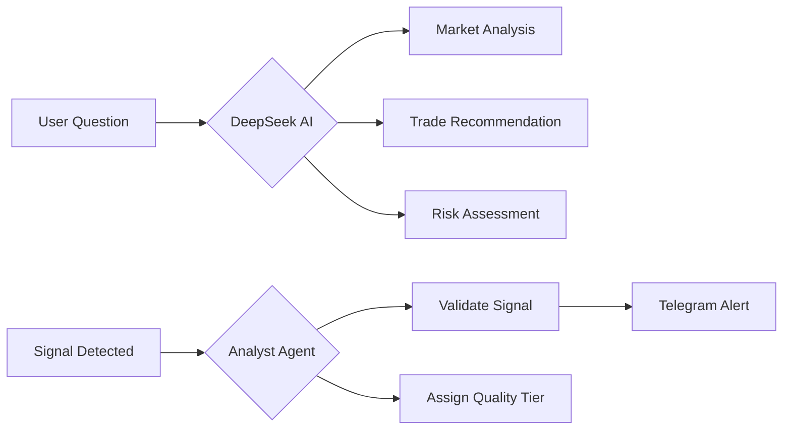

<div align="center">

# 🌌 AXIOM ANTIGRAVITY

### AI Trading Platform & Signal Hub | منصة تداول وإشارات بالذكاء الاصطناعي


**From Signals to Execution — Powered by DeepSeek AI**

**من الإشارات إلى التنفيذ — مدعوم بذكاء DeepSeek**

[](https://aitrading.axiomid.app)
[](LICENSE)
[](https://workers.cloudflare.com)
[](https://capital.com)

---

*"We don't just signal. We execute."*

*"نحن لا نكتفي بالإشارات. نحن ننفذ."*

</div>

---

## 🆕 What's New in v0.9 "Spider Web" | الجديد في إصدار 0.9

<table>
<tr>
<td width="50%">

### 🇺🇸 English

- 🕷️ **Spider Web Architecture** — Modular AI brain system
- 🆓 **Workers AI** — FREE LLMs (10K neurons/day)
- 🧠 **DeepSeek V3.2** — 128K context reasoning
- 🛡️ **Risk Guardian** — AI-powered trade validation
- 📡 **Data Collector** — Real-time market context
- 💰 **Capital.com + Alpaca** — Dual broker support

</td>
<td width="50%">

### 🇸🇦 العربية

- 🕷️ **هيكل شبكة العنكبوت** — نظام دماغ ذكاء اصطناعي معياري
- 🆓 **Workers AI** — نماذج LLM مجانية
- 🧠 **DeepSeek V3.2** — تحليل عميق 128K
- 🛡️ **حارس المخاطر** — موافقة ذكية على الصفقات
- 📡 **جامع البيانات** — سياق السوق الحي
- 💰 **Capital.com + Alpaca** — دعم وسيطين

</td>
</tr>
</table>

---

## 📖 Table of Contents | جدول المحتويات

<table>
<tr>
<td width="50%">

### 🇺🇸 English

- [What is Axiom?](#-what-is-axiom)
- [Trading Capabilities](#-trading-capabilities)
- [Twin-Turbo Engines](#-twin-turbo-engines)
- [AI Agents](#-ai-agents)
- [Tech Stack](#-tech-stack)
- [Quick Start](#-quick-start)

</td>
<td width="50%">

### 🇸🇦 العربية

- [ما هو Axiom؟](#-ما-هو-axiom)
- [قدرات التداول](#-قدرات-التداول)
- [محركات Twin-Turbo](#-محركات-twin-turbo)
- [وكلاء الذكاء الاصطناعي](#-وكلاء-الذكاء-الاصطناعي)
- [التقنيات](#-التقنيات)
- [البدء السريع](#-البدء-السريع)

</td>
</tr>
</table>

---

## 🎯 What is Axiom?

**Axiom Antigravity** is a **complete AI trading platform** that combines:

| Layer | Feature | Status |
|-------|---------|--------|
| 📊 **Analysis** | Twin-Turbo signal detection (AEXI + Dream) | ✅ Live |
| 🧠 **Intelligence** | DeepSeek AI for market analysis | ✅ Live |
| 💰 **Execution** | Capital.com Forex/Gold trading | ✅ Live |
| 🤖 **Automation** | AI Bots with Testing/Live modes | ✅ Live |
| 📱 **Alerts** | Telegram instant notifications | ✅ Live |

---

## 🎯 ما هو Axiom؟

**Axiom Antigravity** هو **منصة تداول متكاملة بالذكاء الاصطناعي** تجمع:

| الطبقة | الميزة | الحالة |
|--------|--------|--------|
| 📊 **التحليل** | اكتشاف إشارات Twin-Turbo | ✅ يعمل |
| 🧠 **الذكاء** | DeepSeek للتحليل | ✅ يعمل |
| 💰 **التنفيذ** | تداول Capital.com | ✅ يعمل |
| 🤖 **الأتمتة** | بوتات ذكية | ✅ يعمل |
| 📱 **التنبيهات** | Telegram فوري | ✅ يعمل |

---

## 💰 Trading Capabilities | قدرات التداول

### Supported Brokers | الوسطاء المدعومون

```
┌───────────────────────────────────────┐
│  Capital.com (Forex/CFD) — PRIMARY    │
│  ├── EUR/USD, GBP/USD, USD/JPY        │
│  ├── XAU/USD (Gold), XAG/USD (Silver) │
│  ├── Indices, Stocks CFD              │
│  └── Demo + Live Mode Toggle          │
├───────────────────────────────────────┤
│  Alpaca (Stocks/Crypto) — SECONDARY   │
│  ├── US Stocks (Paper Trading)        │
│  └── Real-time market data            │
└───────────────────────────────────────┘
```

### AI Bot Modes | أوضاع البوت

| Mode | Description | Risk |
|------|-------------|------|
| 🧪 **Testing** | Paper trading, no real money | None |
| 🔴 **Live** | Real Capital.com account | Real |

---

## 🧠 AI Agents | وكلاء الذكاء الاصطناعي



| Spider Agent | Model | Purpose |
|--------------|-------|---------|
| 🕸️ **Core Hub** | Cloudflare Worker | Dispatcher & Orchestrator |
| 🕷️ **Reflex** | Workers AI (Llama 3.1) | Fast pattern matching (FREE) |
| 🧠 **Analyst** | DeepSeek V3.2 | Deep reasoning & strategy |
| 🛡️ **Guardian** | Workers AI | Risk validation (FREE) |
| 📡 **Collector** | APIs (Finnhub) | Data aggregation |
| 📰 **Journalist** | Gemini Flash | Daily briefings |

---

## 🏎️ Twin-Turbo Engines

### AEXI Protocol (Signal Detection)

```
AEXI = (0.4 × EXH) + (0.3 × VAF) + (0.3 × SVP)

┌─────────────────────────────────────────┐
│ EXH = Exhaustion (Z-Score)              │
│ VAF = Velocity/ATR Factor               │
│ SVP = Surveillance Volume Proxy         │
└─────────────────────────────────────────┘

Signal Trigger: AEXI > 80
```

### Dream Machine (Chaos Theory)

```
DREAM = (0.3 × Entropy) + (0.25 × Fractal) + (0.25 × Hurst) + (0.2 × VolDisp)

Signal Trigger: Dream > 70
```

---

## 🎨 Premium Dashboard | لوحة التحكم الفاخرة

### Features

| Component | Description |
|-----------|-------------|
| 🍩 **Portfolio Donut** | Equity allocation visualization |
| 📊 **P/L Chart** | Daily profit/loss with time filters |
| 🤖 **Active Bots** | AI strategies with performance sparklines |
| 💬 **Telegram Widget** | Signals preview in dashboard |
| 🧠 **DeepSeek Panel** | Floating AI chat assistant |
| 🔄 **Mode Toggle** | Testing ↔ Live switch |

---

## 🛠️ Tech Stack | التقنيات

<table>
<tr>
<td width="50%">

### Frontend

- **Next.js 14** — React framework
- **TypeScript** — Type safety
- **Framer Motion** — Animations
- **next-intl** — AR/EN languages

</td>
<td width="50%">

### Backend

- **Cloudflare Workers** — Edge (Python)
- **Capital.com API** — Forex trading
- **Groq** — DeepSeek AI
- **D1 + KV** — Database + Cache

</td>
</tr>
</table>

---

## 🚀 Quick Start | البدء السريع

```bash
# Clone
git clone https://github.com/Moeabdelaziz007/Trading-Bot-System-v0.01.git
cd Trading.System-0.1

# Frontend
cd frontend && npm install && npm run dev

# Backend
cd trading-cloud-brain && wrangler dev

# Deploy
cd frontend && npx vercel --prod
cd trading-cloud-brain && wrangler deploy
```

### Required Secrets

```bash
wrangler secret put GROQ_API_KEY
wrangler secret put CAPITAL_API_KEY
wrangler secret put CAPITAL_EMAIL
wrangler secret put CAPITAL_PASSWORD
```

---

## 💰 Zero-Cost Infrastructure | بنية تحتية بتكلفة صفر

| Service | Free Tier |
|---------|-----------|
| Cloudflare Workers | 100,000 req/day |
| Groq API | 14,400 req/day |
| Capital.com API | Unlimited |
| Vercel | Unlimited |
| Telegram | Unlimited |

**Total Monthly Cost: $0** 💵

---

## 👤 Author | المؤلف

**Mohamed Hossameldin Abdelaziz**

*محمد حسام الدين عبد العزيز*

- 📧 <cryptojoker710@gmail.com>
- 🐙 [@Moeabdelaziz007](https://github.com/Moeabdelaziz007)
- 🌐 [axiomid.app](https://axiomid.app)

---

## 📄 License | الرخصة

MIT License © 2025 Mohamed Hossameldin Abdelaziz

---

<div align="center">

### 🌌 Built with DeepSeek AI + Zero Cost 🌌

**مبني بذكاء DeepSeek + تكلفة صفر**

---

*"From Signals to Execution."*

*"من الإشارات إلى التنفيذ."*

🚀 **v0.9 — Spider Web Edition**

---

## 🤖 Telegram Bot

| Command | Description | AI |
|---------|-------------|----|
| `/start` | Welcome message | - |
| `/status` | System status | - |
| `/ai [text]` | Quick AI chat | Workers AI (FREE) |
| `/analyze [type] [text]` | Deep analysis | DeepSeek |
| `/stoptrade` | Kill switch ON | - |
| `/starttrade` | Resume trading | - |

📖 Full setup guide: `docs/telegram_bot_setup.md`

</div>
