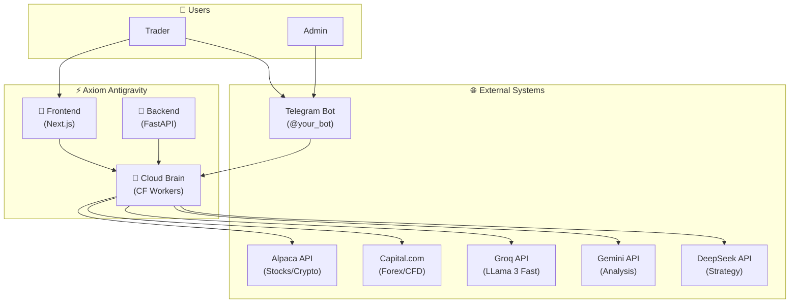
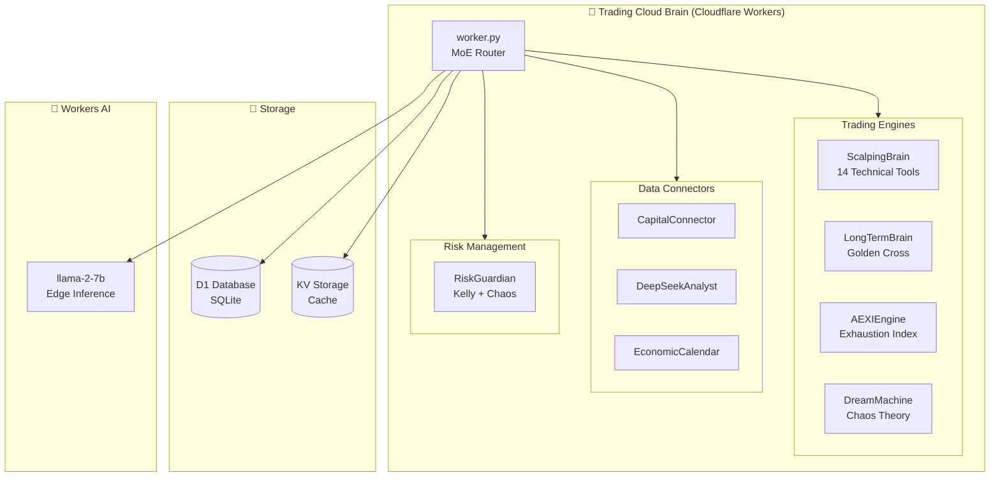
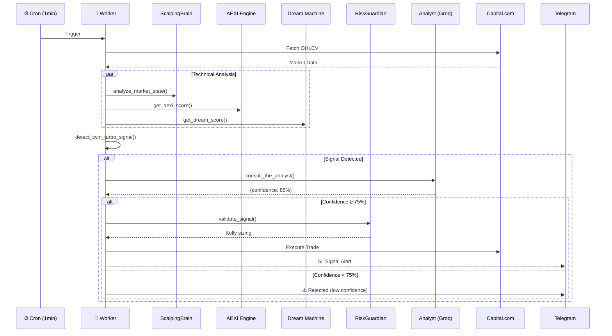
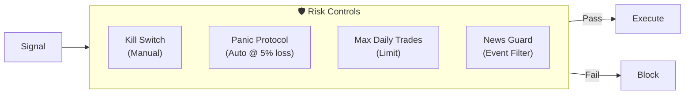

# 🏗️ Axiom Antigravity - Architecture Documentation

> System Architecture v1.0 | Trading System v0.1

---

## 📊 System Context (C4 Level 1)



---

## 🧠 Cloud Brain Containers (C4 Level 2)



---

## 📁 Codebase Structure

```
Trading.System-0.1/
├── frontend/                   # 📱 Vite + React 19 Dashboard
│   └── src/components/        # React components
│
├── backend/                    # 🔧 FastAPI Server
│   ├── main.py                # 14 endpoints + WebSocket
│   └── dual_brain.py          # DeepSeek + Gemini
│
├── trading-cloud-brain/        # 🧠 Cloudflare Workers
│   ├── src/
│   │   ├── worker.py          # Main router (2420 lines)
│   │   ├── scalping_engine.py # 14 technical indicators
│   │   ├── long_term_engine.py# Golden Cross logic
│   │   ├── aexi_engine.py     # Exhaustion detection
│   │   ├── dream_engine.py    # Chaos analysis
│   │   ├── risk_manager.py    # Kelly + Chaos Factor
│   │   ├── capital_connector.py
│   │   └── deepseek_analyst.py
│   ├── wrangler.toml          # Worker config
│   └── schema.sql             # D1 schema
│
└── docs/                       # 📖 Documentation
```

---

## ⚡ Trading Flow



---

## 🔐 Data Models

### D1 Database Tables

| Table | Purpose |
|-------|---------|
| `trading_rules` | Active trading rules |
| `rules` | Rule definitions |
| `trade_logs` | Trade history |
| `user_context` | User preferences |
| `system_state` | Kill switch, panic mode |

### Key Environment Variables

| Variable | Type | Description |
|----------|------|-------------|
| `ABLY_API_KEY` | 🔐 Secret | Real-time updates |
| `CAPITAL_API_KEY` | 🔐 Secret | Capital.com trading |
| `GROQ_API_KEY` | 🔐 Secret | LLM inference |
| `DEEPSEEK_API_KEY` | 🔐 Secret | Strategy analysis |
| `TELEGRAM_BOT_TOKEN` | 🔐 Secret | Bot authentication |

---

## 🎯 AI Agents

| Agent | Model | Purpose | Cost |
|-------|-------|---------|------|
| **Router** | Groq Llama 3 | Intent classification | Free |
| **Analyst** | Groq Llama 3.3 | Signal validation | Free |
| **Strategist** | DeepSeek | Deep analysis | ~$0.001/call |
| **Edge AI** | Workers AI Llama | Fallback | Free |

---

## 🚦 Safety Systems



---

*Generated: 2025-12-08*
